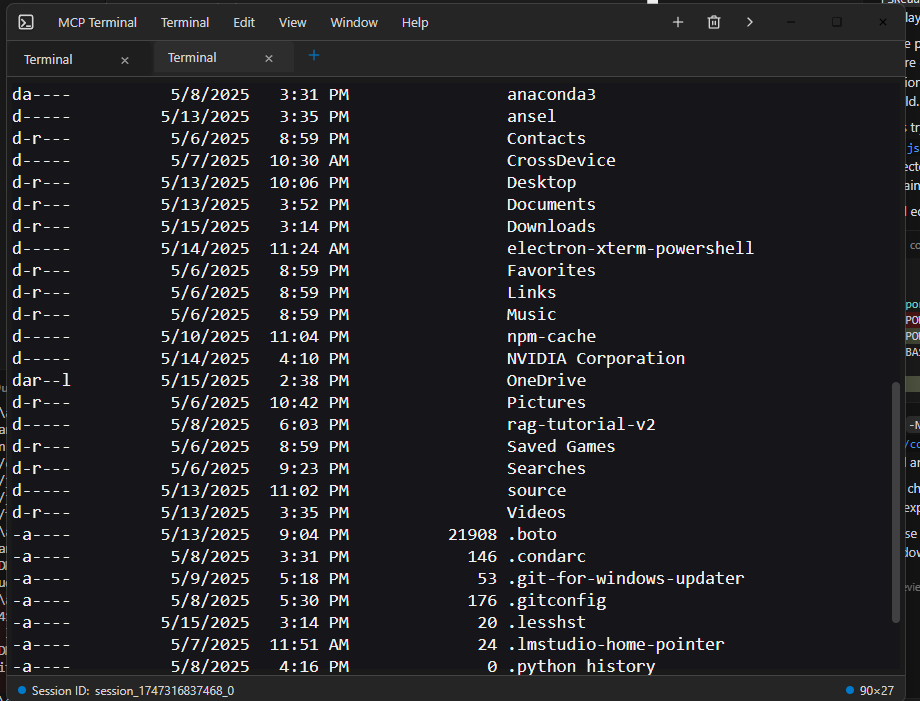

# Electron Terminal MCP Server

## 1. Description

In an ideal world vendors would provide their own MCP integration for the terminal, but in the meantime this project provides a Model Context Protocol (MCP) server that allows clients to interact with a system terminal running within an Electron application. It enables executing commands, managing terminal sessions, and retrieving output programmatically.

The system consists of two main parts:

*   **MCP Server (`index.js`):** A Node.js script that listens for MCP requests via standard input/output (stdio). It uses the `@modelcontextprotocol/sdk` and acts as a bridge to the Electron backend. It automatically starts the Electron backend if it's not already running. It requires [`mcp-package.json`](mcp-package.json:1) to specify `"type": "module"`.
*   **Electron Backend (`main.js`):** The main process for the Electron application. It runs an Express HTTP server (defaulting to port 3000) that the MCP server (`index.js`) communicates with for health checks and API calls. This backend manages the actual terminal processes using `node-pty` within hidden `BrowserWindow` instances loading [`terminal.html`](terminal.html:0).

## 2. Screenshots

Here's how the terminal interaction looks within a client like Claude Desktop:

**Claude Desktop Window with Terminal Output:**


**Individual Electron Terminal Window:**


## 3. Installation

1.  **Prerequisites:** Ensure you have Node.js and npm installed.
2.  **Clone:** Clone the repository if you haven't already.
    ```bash
    git clone <your-repository-url>
    cd command-terminal-electron # Or your repository directory name
    ```
3.  **Install Dependencies:** Install Node modules for both the MCP server and the Electron app.
    ```bash
    npm install
    ```
4.  **Rebuild Native Modules:** Rebuild native modules (like `node-pty`) for Electron.
    ```bash
    node rebuild.js
    ```
    *(See [`rebuild.js`](rebuild.js:1) for details)*

## 3. Usage

1.  **Start the MCP Server:**
    Run the `index.js` script using Node.js. This will listen for MCP commands on stdio and automatically attempt to start the Electron backend process (`main.js`) if it's not already running and listening on the expected HTTP port.
    ```bash
    node index.js
    ```
    *Note: The Electron process runs hidden in the background and automatically gets (re)started whenever its needed and will always be reused if possible.*

2.  **Interacting via MCP:**
    Clients connect to the `node index.js` process via stdio and use the `use_mcp_tool` command. The server name is defined in [`index.js`](index.js:182) as "Electron Terminal".

    **Available Tools:**

    *   **`terminal_start`**: Creates a new terminal session and executes an initial command.
        *   **Input:** `{ "command": "string" }`
        *   **Output:** `{ "content": [...], "sessionId": "string" }`
        ```xml
        <use_mcp_tool>
          <server_name>Electron Terminal</server_name>
          <tool_name>terminal_start</tool_name>
          <arguments>
          {
            "command": "ls -l"
          }
          </arguments>
        </use_mcp_tool>
        ```

    *   **`terminal_execute`**: Executes a command in an existing session.
        *   **Input:** `{ "command": "string", "sessionId": "string" }`
        *   **Output:** `{ "content": [...] }` (Session ID is included in the text content)
        ```xml
        <use_mcp_tool>
          <server_name>Electron Terminal</server_name>
          <tool_name>terminal_execute</tool_name>
          <arguments>
          {
            "sessionId": "session_id_from_start",
            "command": "pwd"
          }
          </arguments>
        </use_mcp_tool>
        ```

    *   **`terminal_get_output`**: Retrieves the accumulated output for a session.
        *   **Input:** `{ "sessionId": "string" }`
        *   **Output:** `{ "content": [...] }`
        ```xml
        <use_mcp_tool>
          <server_name>Electron Terminal</server_name>
          <tool_name>terminal_get_output</tool_name>
          <arguments>
          {
            "sessionId": "session_id_from_start"
          }
          </arguments>
        </use_mcp_tool>
        ```

    *   **`terminal_stop`**: Terminates a specific terminal session process.
        *   **Input:** `{ "sessionId": "string" }`
        *   **Output:** `{ "content": [...] }`
        ```xml
        <use_mcp_tool>
          <server_name>Electron Terminal</server_name>
          <tool_name>terminal_stop</tool_name>
          <arguments>
          {
            "sessionId": "session_id_from_start"
          }
          </arguments>
        </use_mcp_tool>
        ```

    *   **`terminal_get_sessions`**: Lists all currently active sessions managed by the Electron backend.
        *   **Input:** `{}`
        *   **Output:** `{ "content": [...] }` (Content contains a JSON string of active sessions)
        ```xml
        <use_mcp_tool>
          <server_name>Electron Terminal</server_name>
          <tool_name>terminal_get_sessions</tool_name>
          <arguments>
          {}
          </arguments>
        </use_mcp_tool>
        ```

## 5. Synergy with Filesystem MCP Server

This Electron Terminal MCP server works very effectively in conjunction with the [Filesystem MCP Server](https://github.com/modelcontextprotocol/servers/tree/main/src/filesystem). You can use the Filesystem server to browse directories, read/write files, and then use this terminal server to execute commands within those directories or related to those files, providing a comprehensive remote development and interaction experience that works seamlessly together with for example the internet search function built into claude desktop.

## 6. Requirements

*   Node.js (v20 or later recommended, I use node 22)
*   npm
*   Operating System compatible with Electron (Windows, macOS, Linux)

## 7. Configuration

*   **HTTP Port (Electron Backend):** The internal HTTP server run by the Electron backend (`main.js`) defaults to port `3000`. The MCP server (`index.js`) expects to connect to this port for health checks and API calls. You can change the port used by the Electron backend by setting the `PORT` environment variable *before* the Electron process is launched by [`index.js`](index.js:109).
    *   The `apiBaseUrl` in [`index.js`](index.js:21) is constructed using this port and should be consistent. If you change the port the Electron app listens on, ensure the logic in [`index.js`](index.js) that starts Electron and defines `apiBaseUrl` is also aware of this change.

## 8. License

This project is licensed under the MIT License. See the LICENSE file for details.